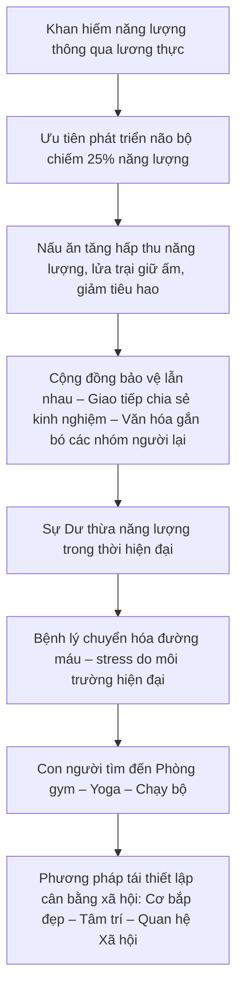

# Vòng xoay năng lượng và tiến hóa của loài người

> “Con người không bao giờ ngừng tiến hóa – chỉ là tiến hóa bây giờ mang dáng hình của ý chí và lựa chọn.”

Có lần, tôi bất chợt nhớ tới hình ảnh những tổ tiên Homo erectus ngồi quanh lửa trại. Không phải vì thấy mình giống họ ở sự cứng cáp – mà vì một câu hỏi: liệu việc tôi đang làm lúc này có phải là một hình thức tiến hóa?

Câu hỏi ấy dẫn tôi đi trên một vòng xoay: từ đói rét tiền sử đến siêu thị đầy ắp đồ ăn, từ bộ não đói năng lượng đến thân thể phải đốt cháy năng lượng dư thừa. Và giữa hai cực ấy, con người đã xoay xở, thích nghi, sáng tạo – để rồi tự đặt ra thử thách mới cho chính mình.

## I. Bộ não – gã quý tộc tiêu hao xa xỉ

Bộ não con người – chỉ nặng chừng 1,4 kg, chưa tới 2% trọng lượng toàn thân – vậy mà lại “ăn vặt” tới 20–25% tổng năng lượng nền của cơ thể. Tức là cứ 4 bát cơm ta ăn, thì riêng cái đầu đã xơi hết một bát, ngồi im cũng không tha. Một sự xa xỉ đến kỳ lạ.

Tôi thường tưởng tượng bộ não như một ông quý tộc thời phong kiến – mảnh mai, kiêu kỳ, chẳng lao động chân tay gì nhiều mà vẫn được nuông chiều tối đa. Nhưng oái oăm thay, chính cái gã quý tộc ấy lại là kẻ nắm vận mệnh của cả thân xác. Tim có ngừng đập đôi nhịp thì còn có thuốc trợ tim, nhưng não chỉ cần thiếu dưỡng khí vài phút là toàn bộ “triều đình” sụp đổ.

Năm 1995, hai nhà nghiên cứu Aiello và Wheeler đã đưa ra một giả thuyết táo bạo, mang tên *Expensive Tissue Hypothesis*. Họ cho rằng: **để bộ não to ra, ruột phải nhỏ lại**. Cơ thể chỉ có ngần ấy tài nguyên – nếu muốn đầu tư cho não, phải cắt giảm ở nơi khác. Và ruột – vốn là kẻ tham ăn khét tiếng – đành ngậm ngùi chịu thiệt.

Giả thuyết này khiến tôi suy nghĩ rất lâu. Phải chăng, ngay từ thuở hồng hoang, loài người đã phải “cân đối ngân sách” giữa tiêu hóa và tư duy? Và nếu vậy, họ làm cách nào để vừa thu nhỏ hệ tiêu hóa, vừa không chết đói?

Câu trả lời nằm ở một phát minh mà chúng ta đã quá quen để còn ngạc nhiên: **ngọn lửa**. Nhờ lửa, tổ tiên ta biết nấu chín thức ăn. Thức ăn nấu chín không chỉ mềm hơn, dễ nhai hơn, mà còn giúp ruột hấp thu dinh dưỡng nhanh hơn nhiều. Thay vì cắn thịt sống thì giờ chỉ cần nướng lên một chút là đã đủ năng lượng cho cả ngày.

Tôi chợt nhận ra: tiến hóa không phải là chuyện của gen, mà còn là **chuyện của bếp**.

Và nếu hôm nay ta vẫn sống nhờ một bộ não quá khổ và một hệ tiêu hóa tiết kiệm, thì ân nhân thầm lặng của ta chính là cái bếp lửa đã được nhóm lên cách đây hàng trăm nghìn năm.

## II. Lửa – cuộc cách mạng không khói súng

Tôi còn nhớ lần đầu tiên tự nhóm bếp củi ở quê nội. Lửa bén rất chậm, khói xộc lên cay mắt, tro bay tung tóe, phải mất gần nửa tiếng mới đun sôi được nồi nước luộc rau. Khi ấy, tôi tự hỏi: sao người xưa có thể sống được với thứ “công nghệ lạc hậu” như thế?

Nhưng tôi đã nhầm. Hoàn toàn nhầm.

Bởi vì lửa, với toàn bộ sự thô sơ và khói bụi của nó, chính là **cuộc cách mạng năng lượng đầu tiên** của loài người.

Trước khi có lửa, tổ tiên ta phải nhai suốt nhiều giờ mỗi ngày – như loài tinh tinh bây giờ vẫn làm. Một chiếc hàm nhai thức ăn sống chẳng khác gì một cỗ máy nghiền công nghiệp – hao mòn, chậm chạp, kém hiệu quả. Nhưng từ khi có lửa, tất cả đổi khác. Không cần đến bánh xe, không cần đến điện, chỉ một bó củi cháy đỏ đã làm nên điều mà cả triệu năm tiến hóa không thể: **tiết kiệm năng lượng sống**.

Richard Wrangham – nhà nhân học từng sống nhiều năm giữa rừng rậm châu Phi – là người đã khẳng định điều ấy. Trong cuốn sách *Catching Fire: How Cooking Made Us Human*, ông viết rằng **chính nấu ăn đã khiến não người phình to**, khiến ta trở thành *Homo sapiens* – sinh vật biết suy tư, biết mơ mộng, biết kể chuyện quanh bếp lửa.

Lửa không chỉ làm thức ăn mềm và ngọt – nó còn:

- Triệt tiêu vi khuẩn, nấm mốc và độc tố có trong thực phẩm thô  
- Giảm thời gian tiêu hóa, tăng tốc độ hấp thu năng lượng  
- Giải phóng con người khỏi lao động tiêu hóa kéo dài để **làm những việc không sinh học: trò chuyện, hợp tác, mơ mộng**

Và quan trọng nhất – lửa mang đến **sự ấm áp có thể kiểm soát được**.

Hãy thử tưởng tượng thời tiền sử: rừng rậm, mưa phùn, thú dữ rình rập, cái lạnh xuyên đêm như dao cắt. Một nhóm người nếu có lửa sẽ sống sót – không chỉ về mặt vật lý mà cả về mặt xã hội. Vì quanh bếp lửa, người ta không chỉ sưởi ấm, mà còn **chuyền nhau câu chuyện, luật lệ, và những ký ức tập thể đầu tiên**.

Tôi từng đọc một dòng rất hay trong một nghiên cứu về văn hóa nguyên thủy: *"Where there is fire, there is a tribe."* – Nơi nào có lửa, nơi đó có cộng đồng.

Thế nên, lửa không chỉ là công cụ – nó là **nền móng văn hóa**.  

Từ những đốm sáng đầu tiên trong đêm rừng, con người bắt đầu một hành trình hoàn toàn khác: hành trình sống không chỉ để tồn tại, mà để hiểu nhau, để cùng nhau.

## III. Từ khan hiếm sang dư thừa – một bước ngoặt nguy hiểm

Nếu có cỗ máy thời gian, tôi rất muốn đưa một người tiền sử đến siêu thị gần nhà – nơi ánh đèn không bao giờ tắt, kệ hàng lúc nào cũng đầy ắp, thịt cá được đóng gói sạch sẽ, rau củ được xịt sương để trông như vừa hái.  

Tôi chắc rằng họ sẽ hoang mang – nhưng cũng sẽ thấy xúc động. Bởi cả cuộc đời họ, và cả lịch sử của giống loài họ, là một cuộc vật lộn không ngơi nghỉ với **khan hiếm**.

Nhưng tôi thì ngược lại. Tôi sống trong một thế giới mà **vấn đề không còn là thiếu ăn, mà là ăn quá dễ dàng**. Không cần săn bắn, không cần hái lượm – chỉ cần một cú nhấn nút, một cú quẹt thẻ, là năng lượng tràn ngập cơ thể. Mỡ tích tụ. Đường huyết tăng. Thân xác mỏi mệt mà chẳng rõ vì sao.

Ngày xưa, chúng ta **cần năng lượng để sống sót**. Giờ đây, ta **phải sống sót khỏi năng lượng thừa**.

Đó là một nghịch lý lớn của thời hiện đại.

- Ngày xưa, nhai một rễ củ cứng là sống.  
  Ngày nay, nuốt một viên đường tinh luyện là nguy cơ.  
- Ngày xưa, chạy vì sợ hổ.  
  Giờ đây, ta chạy trên máy, trong phòng kín, để giảm stress.  
- Ngày xưa, ăn no là hạnh phúc.  
  Giờ đây, nhịn ăn gián đoạn là phương pháp "wellness".  

Tôi từng đọc một dòng của Herman Pontzer – nhà nghiên cứu về trao đổi chất:  
> “Năng lượng không phải là điều hiếm nữa, mà là thứ ta cần kiểm soát giống như người xưa từng kiểm soát lửa.”

Và đó là lý do vì sao **chúng ta tự tạo ra sự khan hiếm nhân tạo** – nhịn ăn gián đoạn, detox, chạy marathon, tập gym. Những việc tưởng chừng phi lý – nhưng lại là **bản năng sinh tồn tái hiện**.

## IV. Phòng gym – nơi biểu diễn hình thể hay rèn luyện tiến hóa?

Có lần tôi ngồi ở một quán cà phê gần khu trung tâm, nơi các phòng tập gym mọc san sát như nấm sau mưa. Từ góc nhìn tầng hai, tôi thấy những người trẻ ra vào, người thì vai u, người thì bụng phẳng, dáng đi cũng khác – nhanh nhẹn và có phần hơi kiêu hãnh.

Tôi nhận ra: **phòng gym ngày nay không còn chỉ là nơi rèn luyện sức khỏe**, mà đã trở thành một **sân khấu hiện hình của ý chí cá nhân** – nơi con người hiện đại tìm cách khẳng định bản thân, không qua học vị hay địa vị, mà qua… cơ bắp.

Không thể phủ nhận những lợi ích sinh học – tập gym giúp điều hòa huyết áp, giảm stress, phòng ngừa thoái hóa – nhưng bên cạnh đó, **giới trẻ ngày nay đang ngày càng gắn giá trị bản thân với hình thể mà họ sở hữu**.

Có những cái tên nổi lên không nhờ một sản phẩm nghệ thuật hay một hành động xã hội nào đặc biệt, mà chỉ bởi họ... **ăn ít và tập nhiều**. Angela Phương Trinh chẳng hạn – không còn ồn ào như một thời, nhưng bất ngờ trở lại truyền thông chỉ bằng một lối sống “kỷ luật” gồm nhịn ăn, thiền định và tập gym. Dù từng vướng không ít scandal, hình ảnh mới của cô vẫn dễ dàng thu hút hàng nghìn người theo dõi – đặc biệt là trong giới trẻ khao khát một **thân thể có kiểm soát và được ngưỡng mộ**.

Tôi không bàn về nhân vật cụ thể. Nhưng xu hướng thì rất rõ: **nhiều người đang xem hình thể như thước đo kỷ luật**, như một loại “bằng chứng sống” rằng mình không buông thả, không yếu đuối, không thua cuộc giữa thời đại đầy cám dỗ này.

Chúng ta đang sống trong một xã hội mà phần nhìn rất mạnh – nơi mà bức ảnh tập gym mỗi ngày có thể gây ấn tượng hơn cả một thành tựu thầm lặng. Và ở đó, thân thể không còn chỉ là phương tiện sống, mà còn là **bản lý lịch thị giác**, được xây dựng bằng mồ hôi và protein shake.

Nhưng điều thú vị là: trong chính cái thế giới tưởng như vật chất ấy, **con người lại đang lặp lại hành vi sinh học nguyên thủy nhất – tìm cách thích nghi để sinh tồn**. Chỉ có điều, thay vì tránh thú dữ, ta tránh cholesterol xấu. Thay vì đốt củi giữ ấm, ta đốt mỡ giữ dáng.

Có thể nói: **con người hiện đại đang tiến hóa theo một hướng khác – hướng vào bên trong**, nơi mỗi động tác squat, mỗi bữa ăn kiểm soát calo, là một nỗ lực âm thầm để lấy lại sự cân bằng giữa một thế giới thừa mứa và một bản thể dễ tổn thương.

Không còn chạy vì bị săn đuổi. Giờ đây, ta chạy vì không muốn chính mình trở thành con mồi – của stress, của bệnh tật, của những đánh giá ngấm ngầm từ xã hội.

## V. Một vòng tròn – từ khan hiếm đến cân bằng

Hãy thử hình dung một sơ đồ:

Một chu kỳ – nhưng không phải quay về điểm cũ. Mỗi vòng xoay mang theo một cấp độ tiến hóa mới. Và lần này, sự tiến hóa không còn đến từ tự nhiên, mà đến từ **ý chí tự thân**.

---

## Đọc thêm

- Aiello, L., & Wheeler, P. (1995). *The Expensive Tissue Hypothesis*. *Current Anthropology*  
- Wrangham, R. (2009). *Catching Fire: How Cooking Made Us Human*. Basic Books  
- Pontzer, H. (2021). *Burn: The Misunderstood Science of Metabolism*. Penguin Press  
- Lieberman, D. (2013). *The Story of the Human Body: Evolution, Health, and Disease*. Vintage  

---

> "Có thể tổ tiên tôi từng phải đốt củi để nấu ăn. Còn tôi – tôi đốt calories để tìm lại sự cân bằng."

---
